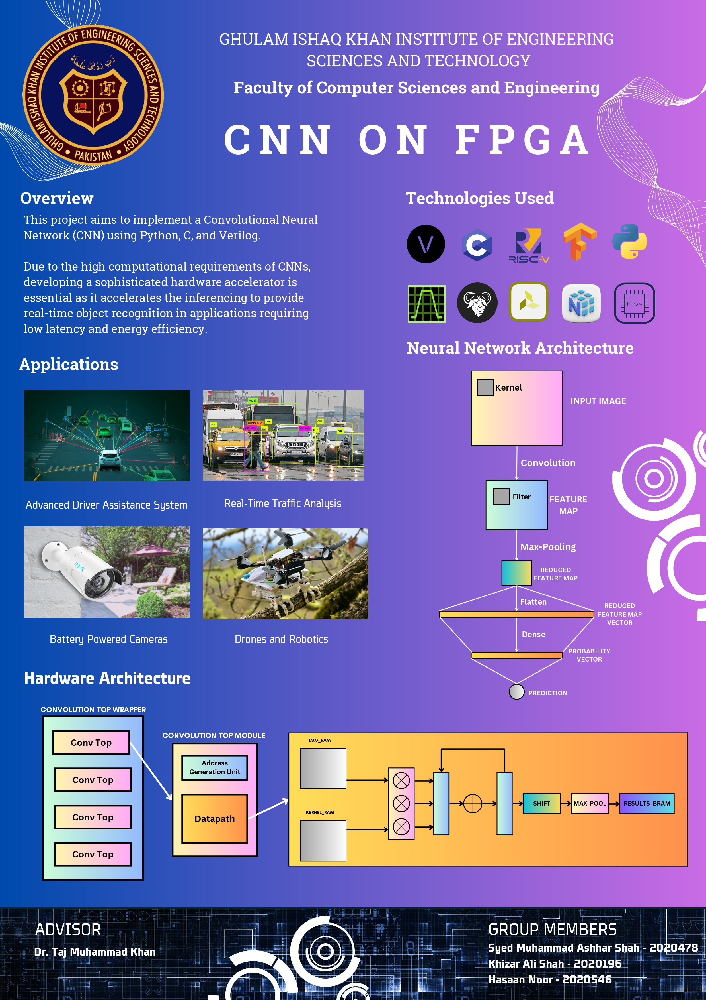

# FPGA-based Hardware Accelerator of Convolutional Neural Network

## Project Description:

State-of-the art Convolutional Neural Networks implemented on Software or on GPUs are not suitable for limited-resource edge computing circumstances such as on mobile devices, IoT devices, and electric vehicles -- where real-time inference from object detection models is required. Morevoer, they are not suitable for battery-powered systems, specially for drones and electic vehicles because of their high energy consumption of GPUs and large sizes, low and limited performance on realtime processing.

An FPGA-based Hardware Accelerator for optimized CNN is energy-efficient and more attractive due to its high accuracy and scalability. It solves all these problems: Faster inference than Software-based as well as GPU-based CNNs. Less energy consumption as compared to GPUs. Optimal for resource-constrained devices.

In this project, we are building a CNN as well as a RISC-V Processor from scratch. We will join these together, resulting in a complete system. Then this system will be deployed on an FPGA-chip.

The performance on multiple metrics will be cross-tested with other forms of implementations:
- CNN using Tensorflow
- CNN using Python
- CNN using C
- CNN using Verilog on FPGA
- CNN + RISCV on FPGA

### CNN (Convolutional Neural Network):

CNNs have been in use since 1980s; However,
the major breakthroughts in image recognition came in 2012 when Microsoft
Research introduced AlexNet. Then in 2014, ResNet was introduced which solved
the issues of vanishing gradient with the previous CNNs when the layers went deep.

In many areas (name a few), Image Recognition requires fast inference, low-power
consumption if used in small devices. All these requirements can simply
not be filled with the slow but cheap Software-based Implementation of CNNs,
and can barely be the filled with the energy and cost expensive GPUs.

### FPGA (Field Programmable Gate Array):

(Write 'What is an FPGA?')

### RISC-V (Reduced Instruction Set Computer):

(Write 'What is RISC-V?')

## Team

We are senior year undergraduate Computer Science students from [GIKI - Ghulam Ishaq Khan Institute](https://giki.edu.pk), and this is our Senior Design Project.

-   Mentor: [Dr. Muhammad Taj](https://github.com/tajkhan)
-   [Hasaan Noor](https://github.com/hasaannoor)
-   [Ashhar Shah](https://github.com/ashharshah)
-   [Khizar Ali Shah](https://github.com/khizaralishah1)